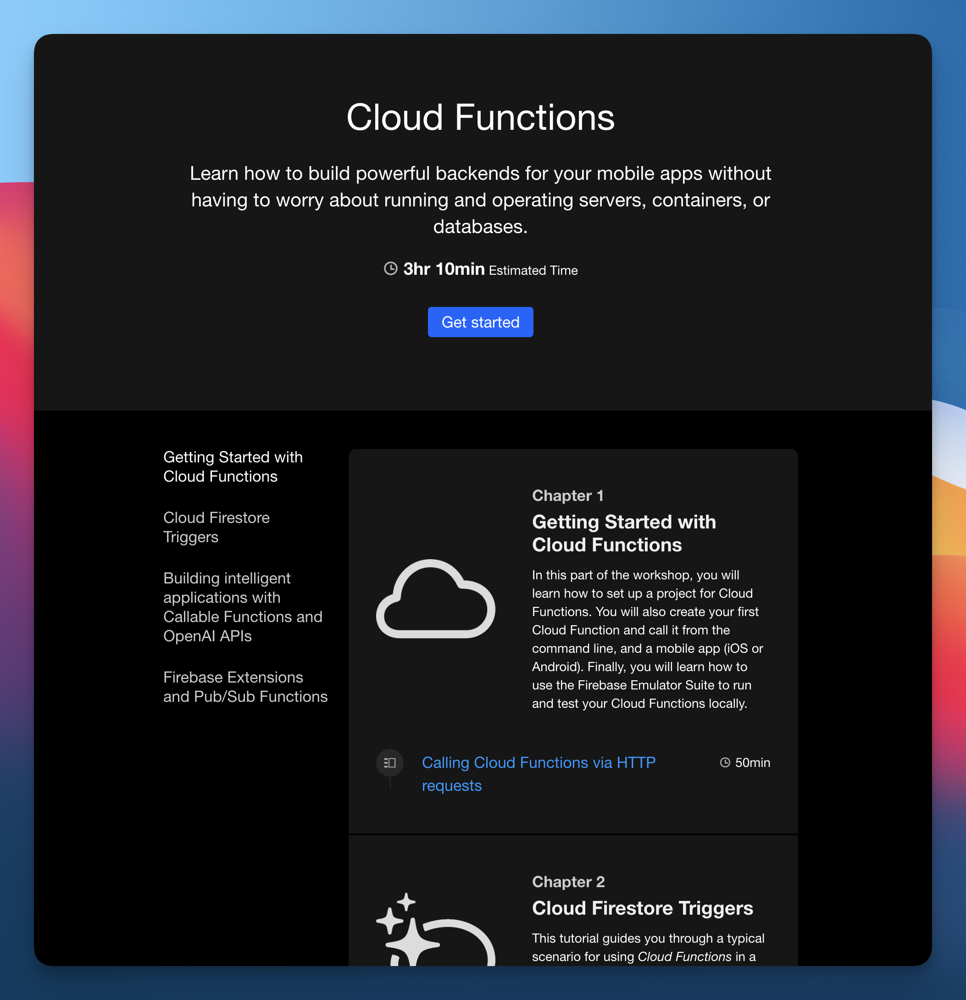

# Supercharge Your App with Cloud Functions for Firebase

This repository contains the website with the interactive tutorials for the workshop [Supercharge Your App with Cloud Functions for Firebase](https://appdevcon.nl/session/supercharge-your-mobile-apps-with-cloud-functions-for-firebase/) that [Zamzam](https://twitter.com/zamzampooya) and [Peter](https://twitter.com/peterfriese) gave at Appdevcon 2023 in Amsterdam.

## Tutorial

Click [here](https://zamzamfp.github.io/Cloud-Functions-Workshop-Tutorial/tutorials/superchargeyourappwithcf/) to launch the interactive tutorial.

## Slides

Click [here](assets/Supercharge%20your%20app%20with%20Cloud%20Functions%20for%20Firebase%20-%20Appdevcon%202023.pdf) to see the slides for the workshop.